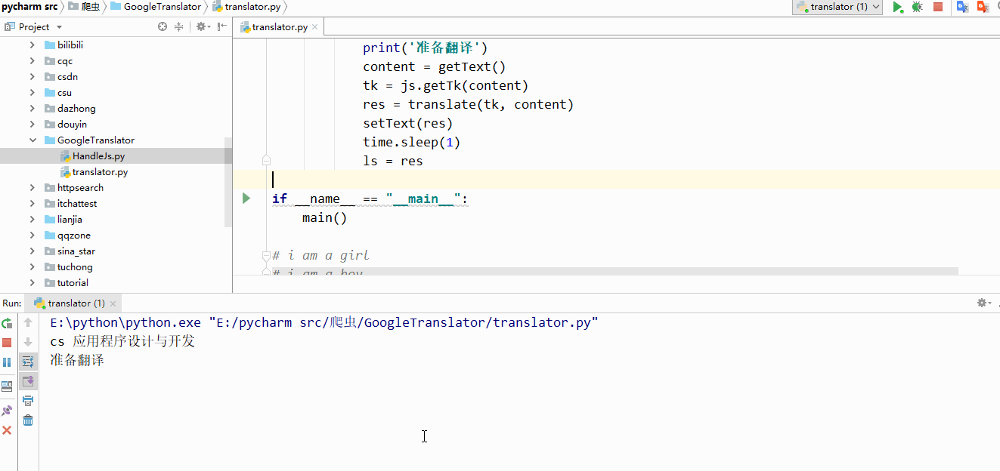

  </a>
  </a>

# 项目简介

办公自动化好助手，自动翻译并填充系统剪贴板内容。

  </a>

# 作者简介

|作者|[inspurer](https://inspurer.github.io/2018/06/07/%E6%9C%88%E5%B0%8F%E6%B0%B4%E9%95%BF%E7%9A%84%E7%94%B1%E6%9D%A5/#more)|
|:---:|:---:|
|QQ交流群|[861016679](https://jq.qq.com/?_wv=1027&k=5Js6sKS)|
|个人博客|[https://inspurer.github.io/](https://inspurer.github.io/)|

更多精彩请关注公众号，微信扫描下方二维码或者在微信内搜索 **微信公众号：月小水长（ID:inspurer)**；

  </a>

